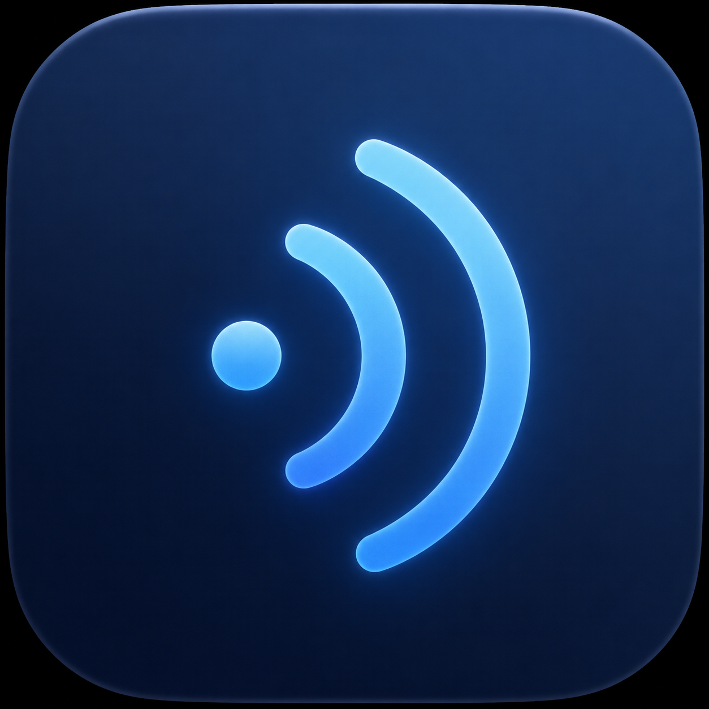

<div align="center">
  
  <h1>MindWhisper</h1>
  <p><strong>Hold-to-talk dictation for macOS.</strong> Press a key, speak, release — your words appear at the cursor.</p>
  <p>
    <a href="https://mind-whisper.liveq.ai"></a>
    <a href="https://github.com/AllenGao6/mind-whisper/releases/latest"></a>
    <a href="./LICENSE"></a>
    
  </p>
  <p><strong>🌐 <a href="https://mind-whisper.liveq.ai">mind-whisper.liveq.ai</a></strong> — see how it works and download the app.</p>
</div>

---

MindWhisper sits in your menu bar. Hold a key in any app — Slack, Gmail, your IDE — talk, release, and the transcript pastes at your cursor. Your clipboard is restored automatically, so nothing gets clobbered.

## Features

- **Three providers, one click to switch** — OpenAI Whisper, Deepgram Nova-3 (streaming), and Groq Whisper.
- **Automatic language detection** — speak any supported language; the formatter preserves it.
- **Live floating HUD** — audio meter and interim text next to your cursor as you speak.
- **Formatter presets** — Email, Slack, Bullets, or your own prompt cleans up the transcript before paste.
- **Global shortcuts** — toggle the formatter and switch presets from anywhere. All rebindable.
- **Private & local** — no accounts, no telemetry; audio goes only to the provider you choose.
- **Auto-update** — signed, notarized releases install with one click from the menu bar.

## Install

Download from **[mind-whisper.liveq.ai](https://mind-whisper.liveq.ai)** or the [Releases page](https://github.com/AllenGao6/mind-whisper/releases/latest):

1. Grab the `arm64` (Apple Silicon) or `x64` (Intel) DMG.
2. Open it and drag MindWhisper to Applications.
3. Launch — grant **Microphone**, **Accessibility**, and **Automation** when prompted.

## Providers

Open **Settings → Providers**, pick an engine, and paste an API key. One is enough to start.

| Provider | API key from | Notes |
|---|---|---|
| OpenAI Whisper | [platform.openai.com](https://platform.openai.com/api-keys) | Batch — universal fallback. |
| Deepgram | [console.deepgram.com](https://console.deepgram.com/) | WebSocket streaming, lowest latency. |
| Groq Whisper | [console.groq.com](https://console.groq.com/keys) | Very fast batch. |

## Permissions

MindWhisper needs three macOS permissions, requested on first launch: **Microphone** (record), **Accessibility** (global hotkey), and **Automation** (paste at cursor). If you deny one, re-enable it in **System Settings → Privacy & Security**, then relaunch.

## Develop

```bash
git clone https://github.com/AllenGao6/mind-whisper.git
cd mind-whisper
pnpm install
pnpm dev:desktop   # Electron app (auto-update disabled)
pnpm dev:web       # landing page at http://localhost:3000
```

Requires Node 20+, pnpm 9+, and Xcode Command Line Tools (`xcode-select --install`) for the native keyboard listener.

## License

[MIT](./LICENSE) — crafted by **[liveq.ai](https://liveq.ai)**.
